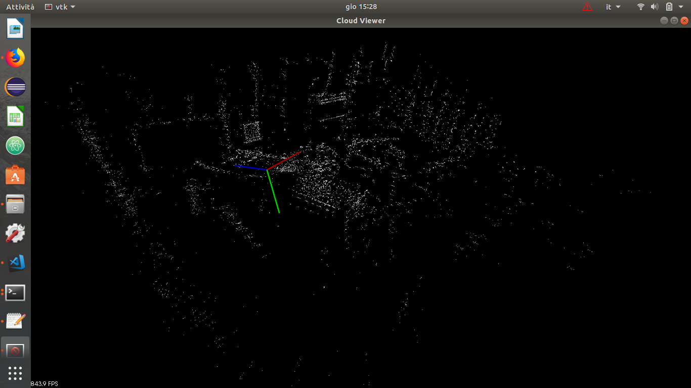
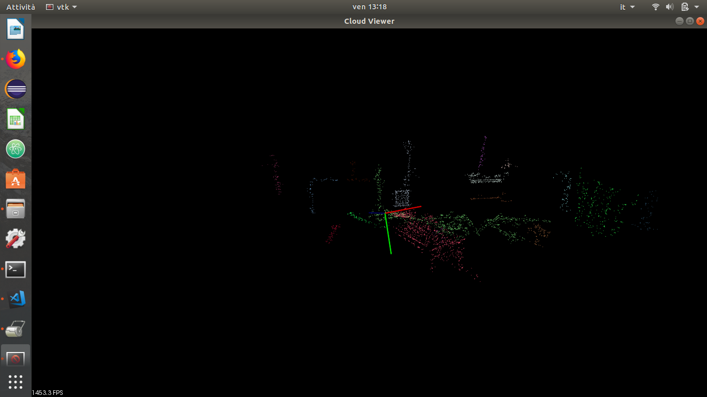
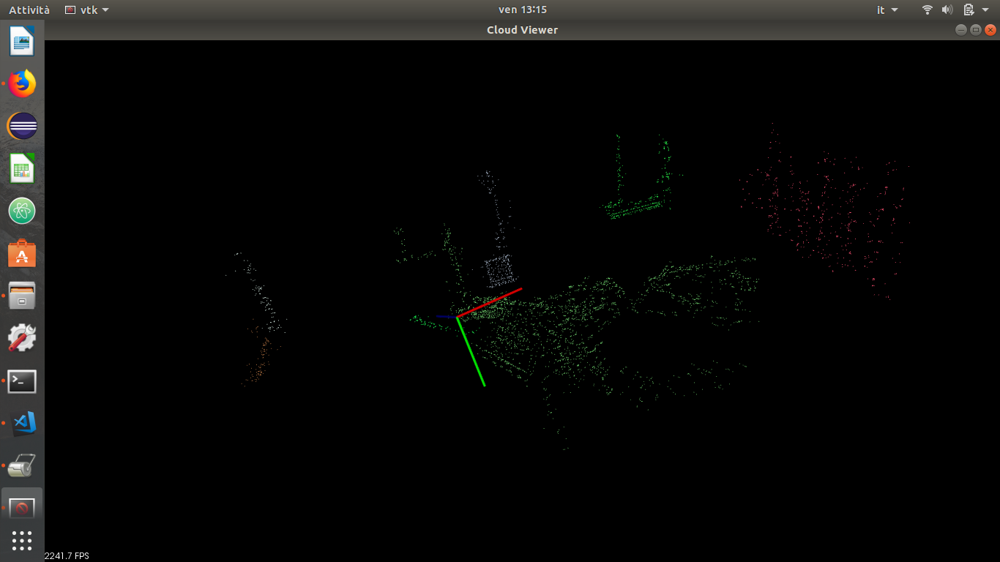

# ROS-HOMEWORK-3
Third homework of cyberphysical class.

This file is part of ROS-Homework-3 and it is distributed under the terms of the
GNU Lesser General Public License (Lesser GPL)

Laboratorio Ciberfisico<br>
[Robot Programming with ROS](http://profs.scienze.univr.it/~bloisi/corsi/ciberfisico.html)<br>
A.Y. 2017/2018<br>
University of Verona (Italy)


## Obiettivo del homework:
Si vuole utilizzare l'algoritmo ORBSLAM per creare una mappa di punti a partire da un video fornito da una BAG.
Una volta ottenuta la mappa, la si salva in un file pcd, per poterla leggere con la libreria PCL.
Infine si visualizzi il point cloud a partire dalla mappa salvata in pcd e si effettui una clusterizzazione dei punti.


## Installazione:
  ### Prerequisiti:
  ```
    -ROS Kinetic
    -Ubuntu 16.04
    -Tutte le dipendenze di ORBSLAM (ad es. Pangolin, Eigein, PCL, OPENCV,...)
    - BAG: <robotics.ethz.ch/%7Easl-datasets/ijrr_euroc_mav_dataset/vicon_room1/V1_01_easy/V1_01_easy.bag>
  ````
  ### Build di ORBSLAM e dei nodi ROS:
  ```
    -chmod +x build_orb.sh
    -./build_orb.sh
  ```
## Esecuzione:
  ### Point Mapping e salvataggio della mappa
  Aprire un terminale:
  ```
    -cd path_repository
    -roscore
  ```
  Aprire un secondo terminale:
  ```
    -cd path_repository
    -cd ORB_SLAM2
    -export ROS_PACKAGE_PATH=${ROS_PACKAGE_PATH}:$(pwd)/Examples/ROS
    -rosrun ORB_SLAM2 Stereo Vocabulary/ORBvoc.txt Examples/Stereo/EuRoC.yaml true
  ```
  Aprire un terzo terminale:
  ```
    -rosbag play --pause path_to_bag cam0/image_raw:=/camera/left/image_raw /cam1/image_raw:=/camera/right/image_raw
  ```
  Una volta finita l'esecuzione della bag, effetturare un ctrl-c sul nodo Stereo per salvare i punti della mappa.<br>
  <b>N.B:</b> la mappa viene salvata nella sottocartella ORB_SLAM2/point/
  
  ### Visualizzazione della point cloud e clusterizzazione:
  Aprire un terminale:
  ```
    -cd path_repository
    -roscore
  ```
  Aprire un secondo terminale:
  ```
    -cd path_repository
    -cd ORB_SLAM2
    -rosrun pcl_ros pcd_to_pointcloud point/mapPoint.pcd
  ```
  Aprire un terzo terminale:
  ```
    -cd path_repository
    -cd ORB_SLAM2
    -export ROS_PACKAGE_PATH=${ROS_PACKAGE_PATH}:$(pwd)/Examples/ROS
    -rosrun ORB_SLAM2 PCL_VIEWER
  ```
  
## Risultati:

Point Cloud:<br>


Euclidean clusterizetion with tolerance value of 0.15 :


Euclidean clusterizetion with tolerance value of 0.18 :

